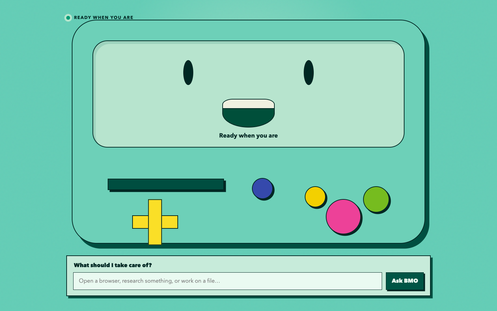

# Personal BMO Companion

A design and prototype repository for a private, full-screen macOS AI Companion: an animated BMO Stage on a selected display, realtime conversation, Codex-backed general computer/browser/coding Tasks, durable local memory, controlled automation, and connected personal services.

## Current status

This repository now contains the first working vertical slice alongside the accepted product architecture, ADRs, implementation PRD, editable architecture diagram, and early Codex protocol proofs:

1. Full-screen selected-display BMO Stage.
2. A general typed natural-language Codex Task.
3. One scoped approval, projected progress, Verified Outcome, and a local Activity Ledger entry.



The implementation decisions and safety model are in [the PRD](docs/COMPANION_PRD.md). The shared domain vocabulary is in [CONTEXT.md](CONTEXT.md), and durable rationale lives in [docs/adr](docs/adr).

## Repository contents

- `docs/COMPANION_PRD.md` — complete build specification and test plan.
- `docs/adr/` — accepted architecture decisions.
- `outputs/AI_AGENT_IMPLEMENTATION_ARCHITECTURE.md` — source/reuse analysis and build sequence.
- `outputs/full-agent-architecture.excalidraw` — editable system diagram; PNG/SVG previews are alongside it.
- `outputs/*.mjs` — early local Codex app-server, Computer Use, and realtime proofs.
- `docs/CONNECTORS.md` — connected-service architecture, safety boundary, setup, and verification.
- `electron/context-packet.ts` — bounded Context Packet selection and manifests for managed Tasks.
- `docs/CONTEXT-PACKETS.md` — Context Packet inclusion, budget, history, and privacy boundaries.

## Important boundaries

- Codex is used as the high-trust execution engine; BMO owns the user relationship, state, memory, approvals, and presentation.
- Connected services remain canonical; the Companion stores references and learned context rather than a default raw mirror.
- The project prohibits permanent deletion of files or source content and requires fresh confirmation for Reserved Actions.
- `work/` is intentionally ignored: it contains third-party research clones and local protocol artifacts, not project source.
- The BMO artwork direction is for a private local build. Sharing or public distribution requires a separate rights review.

## Prototype caveat

The proof scripts expect a local Codex/ChatGPT installation and may require local environment variables. They are research artifacts, not a supported SDK or production interface.

## Run the first vertical slice

Requirements: macOS, Node.js 20+, the ChatGPT/Codex desktop app installed and authenticated, and the relevant Codex capabilities enabled.

```bash
npm install
npm run dev
```

BMO selects a non-primary display when available. Enter a general goal, review the one-Task approval, and choose **Allow this task**. Set `CODEX_CLI_PATH` only when Codex is installed somewhere other than the normal ChatGPT application bundle.

Verification:

```bash
npm run typecheck
npm test
npm run build
```

Open **Connections** in the Stage header to inspect Apple, Google Workspace,
Todoist, GitHub, Obsidian, and secret-broker readiness. Connected-service reads
can be requested directly in typed or realtime voice conversation; writes
always enter the scoped Task approval lifecycle.

Connector setup and proof: [docs/CONNECTORS.md](docs/CONNECTORS.md) and
[docs/CONNECTOR-VERIFICATION.md](docs/CONNECTOR-VERIFICATION.md).
