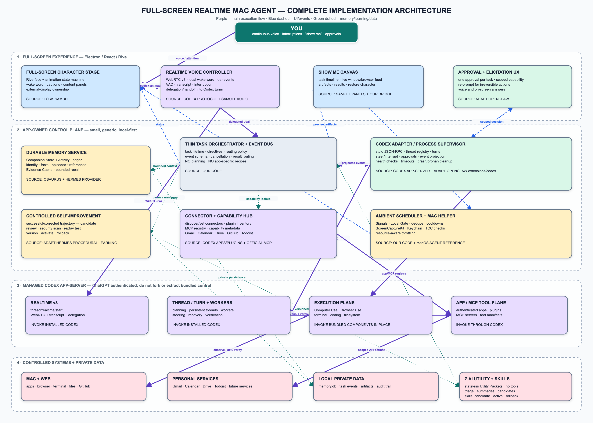

# Full-Screen Realtime Mac Agent — Architecture and Source Map



## Pick-up map

| Our component | Pick up from | Starting locations | Reuse mode |
|---|---|---|---|
| Full-screen Electron/React shell | [Samuel](https://github.com/sambuild04/screen-voice-agent) | `electron/main.ts`, `electron/window-ref.ts`, `src/App.tsx`, `src/styles/app.css` | **Fork**, then replace its overlay window with selected-display full screen |
| Animated character and UI states | Samuel | `src/components/Character.tsx`, `src/components/StatusBar.tsx`, `src/components/Transcript.tsx` | **Fork and redesign** around our BMO-like Rive state machine |
| Audio, wake word, realtime React lifecycle | Samuel | `src/hooks/useRealtime.ts`, `src/hooks/useAudioBuffer.ts`, `src/hooks/useWakeWord.ts`, `electron/handlers/wake-word.ts` | **Adapt** the browser audio plumbing; replace its model transport |
| Approval and content-panel UI | Samuel | `src/components/ToolApprovalCard.tsx`, `src/components/PluginApproval.tsx`, `src/lib/session-bridge.ts` | **Adapt** visuals and renderer/main bridges |
| Ambient Awareness and Local Gate | Our application | New Electron main-process scheduler, connector event handlers, SQLite FTS, deterministic filters, dedupe and cooldowns | **Build** with no resident local neural model |
| Z.ai utility layer | User-provided Z.ai API credits | New stateless `UtilityModelClient` and packet-minimization policy | **Build** as bounded triage/summarization/candidate generation only; no tools, authority or durable memory |
| Realtime voice backend | [OpenAI Codex](https://github.com/openai/codex) | `codex-rs/app-server/README.md`, `codex-rs/app-server-protocol/src/protocol/v2/realtime.rs` | **Invoke installed Codex** using tested WebRTC `v3`; do not reimplement |
| Codex process and JSON-RPC client | Codex + [OpenClaw](https://github.com/openclaw/openclaw) | Codex app-server protocol; OpenClaw `extensions/codex/src/app-server/client.ts`, `client-runtime.ts`, `attempt-startup.ts` | **Write a small adapter**, using Codex as protocol authority and OpenClaw as reliability reference |
| Thread, steering and interruption controller | Codex + OpenClaw | OpenClaw `attempt-steering.ts`, `attempt-turn-watches.ts`, `bounded-turn.ts`, `attempt-terminal.ts` | **Adapt patterns**, not the whole OpenClaw host |
| Approval and elicitation bridge | OpenClaw | `extensions/codex/src/app-server/approval-bridge.ts`, `elicitation-bridge.ts` | **Adapt** into one task-scoped capability controller |
| Event projector | OpenClaw | `extensions/codex/src/app-server/event-projector-*.ts`, `attempt-notifications.ts`, `attempt-results.ts` | **Adapt** to our small stable event schema |
| Computer Use health and cleanup | OpenClaw | `computer-use-health.ts`, `computer-use-service.ts`, `attempt-client-cleanup.ts`, `attempt-timeouts.ts` | **Adapt** health, timeout and orphan-cleanup logic |
| Planning, coding and computer/browser control | Codex Desktop installation | Codex app-server threads and installed Computer Use/Browser Use components | **Invoke in place**. Do not extract, fork or redistribute bundled plugins |
| Durable local memory | [Osaurus](https://github.com/osaurus-ai/osaurus) | `docs/MEMORY.md`, `MemoryDatabase.swift`, `MemoryService.swift`, `MemoryRelevanceGate.swift`, `MemoryConsolidator.swift`, `MemoryContextAssembler.swift` | **Reimplement the architecture** in TypeScript/SQLite; do not import the Swift runtime |
| Replaceable memory boundary | [Hermes](https://github.com/hermes-agent-org/hermes) | `agent/memory_provider.py`, `agent/memory_manager.py`, `tools/memory_tool.py` | **Translate the interface** into TypeScript so memory failures never block conversation |
| Self-improving procedural loop | Hermes | `agent/skill_utils.py`, `tools/skill_manager_tool.py`, `tools/skills_guard.py`, `tests/tools/test_skill_improvements.py` | **Adapt the lifecycle**: candidate → review → test → version → activate/rollback |
| Connector discovery and authorization | Codex apps/plugins + MCP | Codex app-server app/plugin inventory and MCP APIs | **Invoke through Codex**; project connection status into our settings UI |
| Gmail, Calendar and Drive | Codex/ChatGPT Google apps | Installed/authorized app manifests exposed by Codex | **Connect**, do not build custom OAuth unless the required action is unavailable |
| Todoist | Official Todoist MCP or a minimal first-party adapter | Connector hub manifest | **Use official MCP when available**; otherwise build one isolated connector |
| GitHub | Codex GitHub app/plugin | Codex connector inventory | **Invoke through Codex** |
| Native macOS gaps | [macOS Agent](https://github.com/macos26/agent) | `Agent/AgentViewModel/TabHandlers/Accessibility.swift`, `Agent/Services/KeychainService.swift`, `Agent/SDEFs/ScreenSharing.json` | **Reference patterns** for a tiny Swift helper |
| Show Me capture bridge | macOS Agent patterns + our code | ScreenCaptureKit/Accessibility patterns, Electron `WebContentsView` | **Build** only the presentation/capture plane; Codex remains the controller |
| Task orchestrator and event bus | Our application | New TypeScript modules | **Build ourselves**; keep generic and never encode app-specific workflows |
| Private data and audit storage | Our application | SQLite WAL + local artifact directory + macOS Keychain | **Build ourselves** and keep tokens out of transcripts, screenshots and learned skills |

## Repository decision

```text
FORK:
  Samuel UI shell

INVOKE AS INSTALLED:
  Codex app-server
  Codex Realtime WebRTC v3
  Computer Use / Browser Use / coding
  Codex apps/plugins/MCP

USE AS STATELESS UTILITY ONLY:
  Z.ai API for minimized, non-authoritative transforms

ADAPT SELECTED MODULES OR PATTERNS:
  OpenClaw Codex reliability harness
  Osaurus memory architecture
  Hermes memory boundary and procedural learning loop
  macOS Agent permission/capture/Keychain patterns

BUILD OURSELVES:
  thin task orchestrator
  stable event schema
  full-screen behavior
  Show Me presentation bridge
  SQLite implementation
  security gates and skill-review policy
  ambient scheduler, Local Gate and Z.ai packet router
```

## Non-negotiable boundary

The host submits a natural-language goal to Codex. It never hardcodes application selectors, keyboard shortcuts, coordinates, recovery recipes, or task plans. Codex observes, reasons, acts, recovers and verifies; our host manages permissions, task lifetime, memory, presentation and safety.
